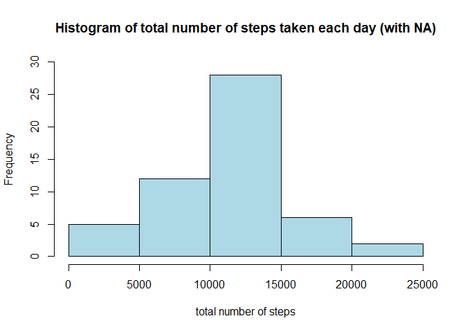
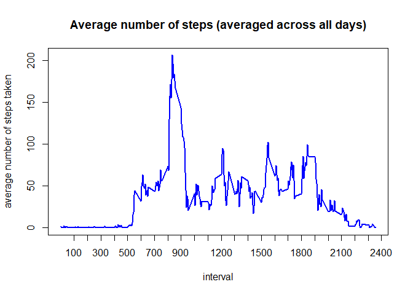
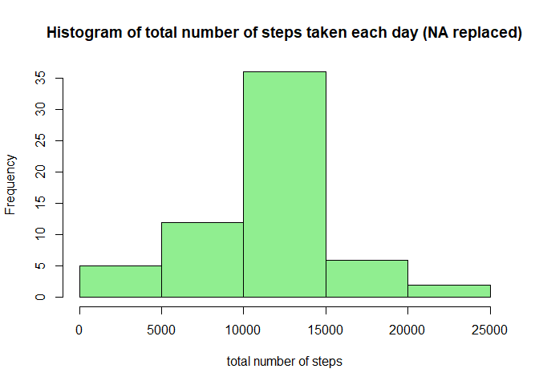
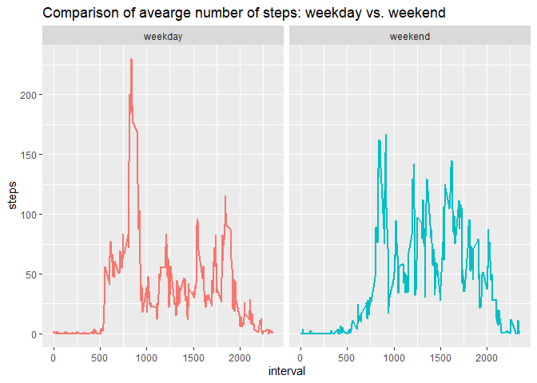

```r
library(dplyr)
library(ggplot2)
```

## Loading and preprocessing the data
This assignment makes use of data from a personal activity monitoring device.
It was collected from an anonymous individual during the months 
of October and November 2012 at 5 minute intervals throughout each day.

The data was provided as a zip file so the first step is to unzip the file and 
then read its contents into a data frame called **data**.  


```r
file <- unzip(zipfile="activity.zip")
data <- read.csv(file)
```
We can have a look at the structure of **data** using the *str* function.

```r
str(data)
```

```
## 'data.frame':	17568 obs. of  3 variables:
##  $ steps   : int  NA NA NA NA NA NA NA NA NA NA ...
##  $ date    : chr  "2012-10-01" "2012-10-01" "2012-10-01" "2012-10-01" ...
##  $ interval: int  0 5 10 15 20 25 30 35 40 45 ...
```
*str* shows that the file contains file 17,568 observations and 3 variables. These
variables are:

* **steps**: Number of steps taking in a 5-minute interval (missing values are coded as NA)
* **date**: The date on which the measurement was taken in YYYY-MM-DD format
* **interval**: Identifier for the 5-minute interval in which measurement was taken

We can observe that some NA values are present but these can be ignored for 
the first part of the assignment as they will be imputed later. So no further
preprocessing is required at this stage.

## What is mean total number of steps taken per day?
The *group_by* function is used to group the data by date and then the
*summarize* function is used to compute the total number of steps per day. The 
results are stored in a variable called **tot_steps_day**.


```r
day <- group_by(data, date)
tot_steps_day <- summarize(day, nsteps=sum(steps))
```

The first 10 observations in **tot_steps_day** are displayed below, where the
first column represents the day and the second column the total number of steps
for that particular day.

```r
tot_steps_day
```

```
## # A tibble: 61 x 2
##    date       nsteps
##    <chr>       <int>
##  1 2012-10-01     NA
##  2 2012-10-02    126
##  3 2012-10-03  11352
##  4 2012-10-04  12116
##  5 2012-10-05  13294
##  6 2012-10-06  15420
##  7 2012-10-07  11015
##  8 2012-10-08     NA
##  9 2012-10-09  12811
## 10 2012-10-10   9900
## # ... with 51 more rows
```

The following chuck of code creates a histogram of the total number of steps 
taken each day. Recall that in this case missing values (coded as NA) are still
present in the data. The *base* graphics package is used for the plot.


```r
hist(tot_steps_day$nsteps,
     main="Histogram of total number of steps taken each day (with NA)",
     xlab="total number of steps",
     col="lightblue", ylim=c(0,30))
```

<!-- -->

The *mean* and *median* functions are used to calculate the mean and median
of the total number of steps taken per day. The answers are reported after the 
code chunk.


```r
st_mean <- mean(tot_steps_day$nsteps, na.rm=TRUE)
st_median <- median(tot_steps_day$nsteps, na.rm=TRUE)
cat("The mean is", st_mean, "and the median is", st_median)
```

```
## The mean is 10766.19 and the median is 10765
```

## What is the average daily activity pattern?

A time series plot of the 5-minute interval (x-axis) and the average number of 
steps taken, averaged across all days (y-axis) is created in this section. 
First the *group_by* function is used to group the data by interval and then the
*summarize* function is used to compute the average number of steps per interval.
The average number of steps per interval is stored in **days_av** to create the
time series plot. The *base* graphics package is used for the plot.


```r
by_interval <- group_by(data, interval)
days_av <- summarize(by_interval, av_steps=mean(steps, na.rm=TRUE))

plot(days_av$interval,days_av$av_steps,type="l",
     main = "Average number of steps (averaged across all days)",
     ylab="average number of steps taken",
     xlab = "interval",
     col="blue", lwd=2, xaxt="n")
xtick <- seq(100, 2500, by=100)
axis(side=1,at=xtick)
```

<!-- -->

To find the 5 minute interval that, on average, contains the maximum number of 
steps, the which.max function can be used as shown in the code chunk below. The result
is reported too.


```r
int_max <- days_av$interval[which.max(days_av$av_steps)]
cat("The 5 minute interval that on average contains the maximum number of steps is:", int_max)
```

```
## The 5 minute interval that on average contains the maximum number of steps is: 835
```

## Imputing missing values
As mentioned earlier, there are missing values in the data (coded as NA). The
total number of NAs is computed and reported below.


```r
NA_tot <- sum(is.na(data$steps))
cat("The total number of missing values (coded as NA) is", NA_tot)
```

```
## The total number of missing values (coded as NA) is 2304
```

The presence of missing values may introduce bias into some calculations or 
summaries of the data and hence need to be imputed. 

The strategy used here to impute missing values is to replace them with the mean 
for that particular 5 minute interval computed over all days, as explained by
the comments in the code chunk itself.
First the data is copied into a new data frame called **data_noNA**, so that 
the NA values can be overwritten with the newly computed values.


```r
data_noNA <- data

for(i in 1:nrow(data)){
  if(is.na(data$step[i])){
    val <- data$interval[i]  # find which interval it is
    idx <- which(data[,3] == val) # get interval index for all days
    new_val <- as.integer(mean(data$steps[idx], na.rm=TRUE)) # calculate the mean for that interval
    data_noNA$steps[i] <- new_val # replace NA by mean value for that interval
  }
}
```

A histogram of the total number of steps taken each day will be created next, 
but this time with the missing values filled in. For this purpose we use the new
data set that has been just created **data_noNA**. Similar to what was done in
the first part of the assignment, the *group_by* function is used to group the 
data by date and then the *summarize* function is used to compute the total 
number of steps per day. The first 10 observations in **tot_steps_day2** is 
displayed. Note that there are no NA values as they have been imputed.


```r
day2 <- group_by(data_noNA, date)
tot_steps_day2 <- summarize(day2, nsteps=sum(steps))
tot_steps_day2
```

```
## # A tibble: 61 x 2
##    date       nsteps
##    <chr>       <int>
##  1 2012-10-01  10641
##  2 2012-10-02    126
##  3 2012-10-03  11352
##  4 2012-10-04  12116
##  5 2012-10-05  13294
##  6 2012-10-06  15420
##  7 2012-10-07  11015
##  8 2012-10-08  10641
##  9 2012-10-09  12811
## 10 2012-10-10   9900
## # ... with 51 more rows
```

```r
##  Make a histogram of the total number of steps taken each day
hist(tot_steps_day2$nsteps,
     main="Histogram of total number of steps taken each day (NA replaced)",
     xlab="total number of steps",
     col="lightgreen")
```

<!-- -->

The *mean* and *median* functions are used again to calculate the mean and median
of the total number of steps taken per day, but this time using the data set
with  missing values filled in (**tot_steps_day2**).


```r
st2_mean <- mean(tot_steps_day2$nsteps, na.rm=TRUE)
st2_median <- median(tot_steps_day2$nsteps, na.rm=TRUE)
cat("The mean is", st2_mean, "and the median is", st2_median)
```

```
## The mean is 10749.77 and the median is 10641
```

```r
cat("     Note that these values do differ from the mean and median (",st_mean,",",st_median,")
     computed in the first part of the assignment when the data had missing values.
     The new median and mean values are smaller.")
```

```
##      Note that these values do differ from the mean and median ( 10766.19 , 10765 )
##      computed in the first part of the assignment when the data had missing values.
##      The new median and mean values are smaller.
```

To determine the impact of imputing missing values the newly created histogram can be compared with
the one from the earlier part of the assignment. It can be observed that the *frequency* (y-axis) for 
the 10000 to 15000 interval range increases to just over 35 (it was under 30 before), but the overall 
shape of the distribution remains the same.
    
## Are there differences in activity patterns between weekdays and weekends?
In order to see if there are any differences between weekdays and weekends, a 
new factor variable with 2 levels - "weekday" and "weekend" - is first created as
shown in the code chunk below to indicate whether a given date is a weekend day 
or weekday. The data set which has all missing values filled in (**data_noNA**) 
is used for this part. 


```r
data_noNA$date <- weekdays(as.Date(data_noNA$date))
data_noNA$type[data_noNA$date %in% c("Monday","Tuesday","Wednesday","Thursday",
                             "Friday")] <- "weekday"
data_noNA$type[data_noNA$date %in% c("Saturday","Sunday")] <- "weekend"
data_noNA$type <- as.factor(data_noNA$type)
```
Now that the data can be easily divided by weekend days and weekdays, a panel plot
can be created to see if there are any differences in activity patterns between
the two. The *ggplot2* package is used to create the plot as shown in the following
code chunk:


```r
plotdata <- aggregate(steps~interval+type,data=data_noNA,FUN=mean)
myplot <- ggplot(plotdata, aes(interval, steps))
myplot + facet_grid(. ~ type) + geom_line(aes(col=type), size=1) +
theme(legend.position = "none") +
labs(title = "Comparison of avearge number of steps: weekday vs. weekend")
```

<!-- -->

A comparison of the 2 panels show that there are differences in activity patterns between weekdays and weekend days. For example, on weekdays the total number of steps for the 500 to 1000 interval range is greater than weekend days for the same range. In contrast, over the weekend the number of steps for the 1000 to 1750 interval range is greater than that for weekdays over the same range.
